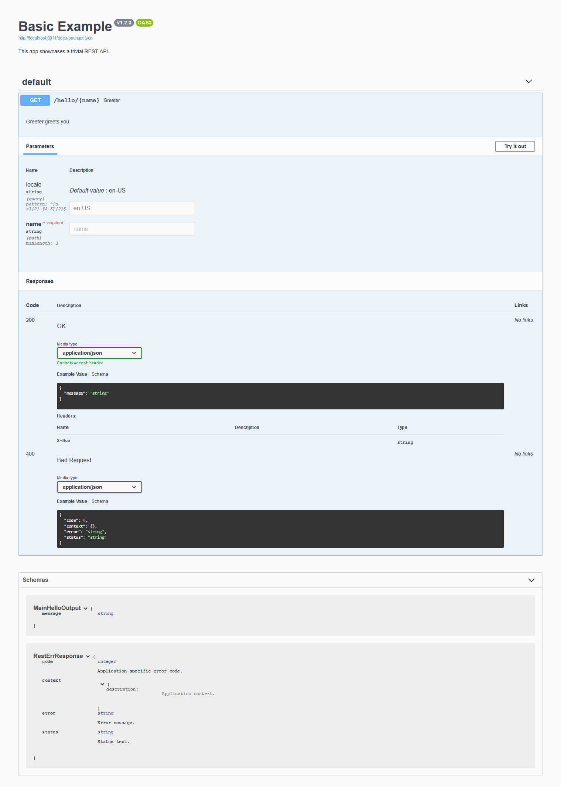

# REST with Clean Architecture for Go

[](https://github.com/swaggest/rest/actions?query=branch%3Amaster+workflow%3Atest-unit)
[](https://codecov.io/gh/swaggest/rest)
[](https://pkg.go.dev/github.com/swaggest/rest)
[](https://wakatime.com/badge/github/swaggest/rest)


This module implements HTTP transport level for [`github.com/swaggest/usecase`](https://github.com/swaggest/usecase) 
to build REST services.

## Goals

* Maintain single source of truth for documentation, validation and input/output of HTTP API.
* Avoid dependency on compile time code generation.
* Improve productivity and reliability by abstracting HTTP details with simple API for common case.
* Allow low-level customizations for advanced cases.
* Maintain reasonable performance with low GC impact.

## Non-Goals

* Support for legacy documentation schemas like Swagger 2.0 or RAML.
* Zero allocations.
* Explicit support for XML in request or response bodies.

## Features

* Compatible with `net/http`.
* Built with [`github.com/go-chi/chi`](https://github.com/go-chi/chi) router.
* Modular flexible structure.
* HTTP [request mapping](#request-decoder) into Go value based on field tags.
* Decoupled business logic with Clean Architecture use cases.
* Automatic type-safe OpenAPI 3.0/3.1 documentation with [`github.com/swaggest/openapi-go`](https://github.com/swaggest/openapi-go).
* Single source of truth for the documentation and endpoint interface.
* Automatic request/response JSON schema validation with [`github.com/santhosh-tekuri/jsonschema`](https://github.com/santhosh-tekuri/jsonschema).
* Dynamic gzip compression and fast pass through mode.
* Optimized performance.
* Embedded [Swagger UI](https://swagger.io/tools/swagger-ui/).
* Generic interface for [use case interactors](https://pkg.go.dev/github.com/swaggest/usecase#NewInteractor). 

## Usage

Please check this [tutorial](https://dev.to/vearutop/tutorial-developing-a-restful-api-with-go-json-schema-validation-and-openapi-docs-2490) for end-to-end usage example.

### Request Decoder

Go struct with field tags defines input port. 
Request decoder populates field values from `http.Request` data before use case interactor is invoked. 

```go
// Declare input port type.
type helloInput struct {
    Locale string `query:"locale" default:"en-US" pattern:"^[a-z]{2}-[A-Z]{2}$" enum:"ru-RU,en-US"`
    Name   string `path:"name" minLength:"3"` // Field tags define parameter location and JSON schema constraints.

    // Field tags of unnamed fields are applied to parent schema, 
	// they are optional and can be used to disallow unknown parameters.
    // For non-body params, name tag must be provided explicitly.
    // E.g. here no unknown `query` and `cookie` parameters allowed,
    // unknown `header` params are ok.
    _ struct{} `query:"_" cookie:"_" additionalProperties:"false"`
}
```

Input data can be located in:
* `path` parameter in request URI, e.g. `/users/{name}`,
* `query` parameter in request URI, e.g. `/users?locale=en-US`,
* `formData` parameter in request body with `application/x-www-form-urlencoded` or `multipart/form-data` content,
* `form` parameter acts as `formData` or `query`,
* `json` parameter in request body with `application/json` content,
* `cookie` parameter in request cookie,
* `header` parameter in request header.

For more explicit separation of concerns between use case and transport it is possible to provide request mapping 
separately when initializing handler (please note, such mapping is [not applied](https://github.com/swaggest/rest/issues/61#issuecomment-1059851553) to `json` body).

```go
// Declare input port type.
type helloInput struct {
    Locale string `default:"en-US" pattern:"^[a-z]{2}-[A-Z]{2}$"`
    Name   string `minLength:"3"` // Field tags define parameter location and JSON schema constraints.
}
```

```go
// Add use case handler with custom input mapping to router.
r.Method(http.MethodGet, "/hello/{name}", nethttp.NewHandler(u,
    nethttp.RequestMapping(new(struct {
       Locale string `query:"locale"`
       Name   string `path:"name"` // Field tags define parameter location and JSON schema constraints.
    })),
))
```

Additional field tags describe JSON schema constraints, please check 
[documentation](https://pkg.go.dev/github.com/swaggest/jsonschema-go#Reflector.Reflect).

More schema customizations are possible with [`github.com/swaggest/jsonschema-go interfaces`](https://github.com/swaggest/jsonschema-go#implementing-interfaces-on-a-type).

By default `default` tags are only contributing to documentation, 
if [`request.DecoderFactory.ApplyDefaults`](https://pkg.go.dev/github.com/swaggest/rest/request#DecoderFactory) is 
set to `true`, fields of request structure that don't have explicit value but have `default` will be populated with 
default value.

If input structure implements [`request.Loader`](https://pkg.go.dev/github.com/swaggest/rest/request#Loader),  
then `LoadFromHTTPRequest(r *http.Request) error` method will be invoked to populate input structure instead 
of automatic decoding. This allows low level control for cases that need it.

<details>
<summary>Request decoder can be used standalone, in already existing `ServeHTTP`.</summary>

```go
type MyRequest struct {
    Foo int    `header:"X-Foo"`
    Bar string `formData:"bar"`
    Baz bool   `query:"baz"`
}

// A decoder for particular structure, can be reused for multiple HTTP requests.
myDecoder := request.NewDecoderFactory().MakeDecoder(http.MethodPost, new(MyRequest), nil)

// Request and response writer from ServeHTTP.
var (
    rw  http.ResponseWriter
    req *http.Request
)

// This code would presumably live in ServeHTTP.
var myReq MyRequest

if err := myDecoder.Decode(req, &myReq, nil); err != nil {
    http.Error(rw, err.Error(), http.StatusBadRequest)
}
```
</details>

### Response Encoder

Go struct with field tags defines output port.
Response encoder writes data from output to `http.ResponseWriter` after use case interactor invocation finishes.

```go
// Declare output port type.
type helloOutput struct {
    Now     time.Time `header:"X-Now" json:"-"`
    Message string    `json:"message"`
    Sess    string    `cookie:"sess,httponly,secure,max-age=86400,samesite=lax"`
}
```

Output data can be located in:
* `json` for response body with `application/json` content,
* `header` for values in response header,
* `cookie` for cookie values, cookie fields can have configuration in field tag (same as in actual cookie, but with comma separation).

For more explicit separation of concerns between use case and transport it is possible to provide response header mapping 
separately when initializing handler.

```go
// Declare output port type.
type helloOutput struct {
    Now     time.Time `json:"-"`
    Message string    `json:"message"`
}
```

```go
// Add use case handler with custom output headers mapping to router.
r.Method(http.MethodGet, "/hello/{name}", nethttp.NewHandler(u,
    nethttp.ResponseHeaderMapping(new(struct {
        Now     time.Time `header:"X-Now"`
    })),
))
```

Additional field tags describe JSON schema constraints, please check 
[documentation](https://pkg.go.dev/github.com/swaggest/jsonschema-go#Reflector.Reflect).

### Creating Use Case Interactor

HTTP transport is decoupled from business logic by adapting
[use case interactors](https://pkg.go.dev/github.com/swaggest/usecase#Interactor).

Use case interactor can define input and output ports that are used to map data between Go values and transport.
It can provide information about itself that will be exposed in generated documentation.

```go
// Create use case interactor with references to input/output types and interaction function.
u := usecase.NewInteractor(func(ctx context.Context, input helloInput, output *helloOutput) error {
    msg, available := messages[input.Locale]
    if !available {
        return status.Wrap(errors.New("unknown locale"), status.InvalidArgument)
    }

    output.Message = fmt.Sprintf(msg, input.Name)
    output.Now = time.Now()

    return nil
})
```

### Initializing Web Service

[Web Service](https://pkg.go.dev/github.com/swaggest/rest/web#DefaultService) is an instrumented facade in front of 
router, it simplifies configuration and provides more compact API to add use cases.

```go
// Service initializes router with required middlewares.
service := web.NewService(openapi31.NewReflector())

// It allows OpenAPI configuration.
service.OpenAPISchema().SetTitle("Albums API")
service.OpenAPISchema().SetDescription("This service provides API to manage albums.")
service.OpenAPISchema().SetVersion("v1.0.0")

// Additional middlewares can be added.
service.Use(
    middleware.StripSlashes,

    // cors.AllowAll().Handler, // "github.com/rs/cors", 3rd-party CORS middleware can also be configured here.
)

// Use cases can be mounted using short syntax .<Method>(...).
service.Post("/albums", postAlbums(), nethttp.SuccessStatus(http.StatusCreated))

log.Println("Starting service at http://localhost:8080")

if err := http.ListenAndServe("localhost:8080", service); err != nil {
    log.Fatal(err)
}

```

Usually, `web.Service` API is sufficient, but if it is not, router can be configured manually, please check 
the documentation below.


## Security Setup

Example with HTTP Basic Auth.

```go
// Prepare middleware with suitable security schema.
// It will perform actual security check for every relevant request.
adminAuth := middleware.BasicAuth("Admin Access", map[string]string{"admin": "admin"})

// Prepare API schema updater middleware.
// It will annotate handler documentation with security schema.
adminSecuritySchema := nethttp.HTTPBasicSecurityMiddleware(apiSchema, "Admin", "Admin access")

// Endpoints with admin access.
r.Route("/admin", func(r chi.Router) {
    r.Group(func(r chi.Router) {
        r.Use(adminAuth, adminSecuritySchema) // Add both middlewares to routing group to enforce and document security.
        r.Method(http.MethodPut, "/hello/{name}", nethttp.NewHandler(u))
    })
})
```

Example with cookie.

```go
// Security middlewares.
//  - sessMW is the actual request-level processor,
//  - sessDoc is a handler-level wrapper to expose docs.
sessMW := func(handler http.Handler) http.Handler {
    return http.HandlerFunc(func(w http.ResponseWriter, r *http.Request) {
        if c, err := r.Cookie("sessid"); err == nil {
            r = r.WithContext(context.WithValue(r.Context(), "sessionID", c.Value))
        }

        handler.ServeHTTP(w, r)
    })
}

sessDoc := nethttp.APIKeySecurityMiddleware(s.OpenAPICollector, "User",
    "sessid", oapi.InCookie, "Session cookie.")

// Security schema is configured for a single top-level route.
s.With(sessMW, sessDoc).Method(http.MethodGet, "/root-with-session", nethttp.NewHandler(dummy()))

// Security schema is configured on a sub-router.
s.Route("/deeper-with-session", func(r chi.Router) {
    r.Group(func(r chi.Router) {
        r.Use(sessMW, sessDoc)

        r.Method(http.MethodGet, "/one", nethttp.NewHandler(dummy()))
        r.Method(http.MethodGet, "/two", nethttp.NewHandler(dummy()))
    })
})

```

See [example](./_examples/task-api/internal/infra/nethttp/router.go).

## Handler Setup

Handler is a generalized adapter for use case interactor, so usually setup is trivial.

```go
// Add use case handler to router.
r.Method(http.MethodGet, "/hello/{name}", nethttp.NewHandler(u))
```

## Example

For non-generic use case, see another [example](./_examples/basic/main.go).

```go
package main

import (
	"context"
	"errors"
	"fmt"
	"log"
	"net/http"
	"time"

	"github.com/swaggest/openapi-go/openapi31"
	"github.com/swaggest/rest/response/gzip"
	"github.com/swaggest/rest/web"
	swgui "github.com/swaggest/swgui/v5emb"
	"github.com/swaggest/usecase"
	"github.com/swaggest/usecase/status"
)

func main() {
	s := web.NewService(openapi31.NewReflector())

	// Init API documentation schema.
	s.OpenAPISchema().SetTitle("Basic Example")
	s.OpenAPISchema().SetDescription("This app showcases a trivial REST API.")
	s.OpenAPISchema().SetVersion("v1.2.3")

	// Setup middlewares.
	s.Wrap(
		gzip.Middleware, // Response compression with support for direct gzip pass through.
	)

	// Declare input port type.
	type helloInput struct {
		Locale string `query:"locale" default:"en-US" pattern:"^[a-z]{2}-[A-Z]{2}$" enum:"ru-RU,en-US"`
		Name   string `path:"name" minLength:"3"` // Field tags define parameter location and JSON schema constraints.

		// Field tags of unnamed fields are applied to parent schema.
		// they are optional and can be used to disallow unknown parameters.
		// For non-body params, name tag must be provided explicitly.
		// E.g. here no unknown `query` and `cookie` parameters allowed,
		// unknown `header` params are ok.
		_ struct{} `query:"_" cookie:"_" additionalProperties:"false"`
	}

	// Declare output port type.
	type helloOutput struct {
		Now     time.Time `header:"X-Now" json:"-"`
		Message string    `json:"message"`
	}

	messages := map[string]string{
		"en-US": "Hello, %s!",
		"ru-RU": "Привет, %s!",
	}

	// Create use case interactor with references to input/output types and interaction function.
	u := usecase.NewInteractor(func(ctx context.Context, input helloInput, output *helloOutput) error {
		msg, available := messages[input.Locale]
		if !available {
			return status.Wrap(errors.New("unknown locale"), status.InvalidArgument)
		}

		output.Message = fmt.Sprintf(msg, input.Name)
		output.Now = time.Now()

		return nil
	})

	// Describe use case interactor.
	u.SetTitle("Greeter")
	u.SetDescription("Greeter greets you.")

	u.SetExpectedErrors(status.InvalidArgument)

	// Add use case handler to router.
	s.Get("/hello/{name}", u)

	// Swagger UI endpoint at /docs.
	s.Docs("/docs", swgui.New)

	// Start server.
	log.Println("http://localhost:8011/docs")
	if err := http.ListenAndServe("localhost:8011", s); err != nil {
		log.Fatal(err)
	}
}

```



## Additional Integrations

* [`github.com/gorilla/mux`](https://github.com/gorilla/mux), see [example](./gorillamux/example_openapi_collector_test.go).

## Performance Optimization

If top performance is critical for the service or particular endpoints, you can trade 
simplicity for performance by implementing manual request loader on input type.

```go
func (i *myInput) LoadFromHTTPRequest(r *http.Request) (err error) {
	i.Header = r.Header.Get("X-Header")

	return nil
}
```

If `request.Loader` is implemented, it will be called instead of both automatic decoding and validation.

Check advanced [example](https://github.com/swaggest/rest/blob/v0.2.29/_examples/advanced-generic/json_body_manual.go#L58).

To further improve performance you may try to use `fasthttp` instead of `net/http` with 
[`rest-fasthttp`](https://github.com/swaggest/rest-fasthttp) fork.

## Versioning

This project adheres to [Semantic Versioning](https://semver.org/#semantic-versioning-200).

Before version `1.0.0`, breaking changes are tagged with `MINOR` bump, features and fixes are tagged with `PATCH` bump.
After version `1.0.0`, breaking changes are tagged with `MAJOR` bump.

Breaking changes are described in [UPGRADE.md](./UPGRADE.md).

## Advanced Usage

[Advanced Usage](./ADVANCED.md)